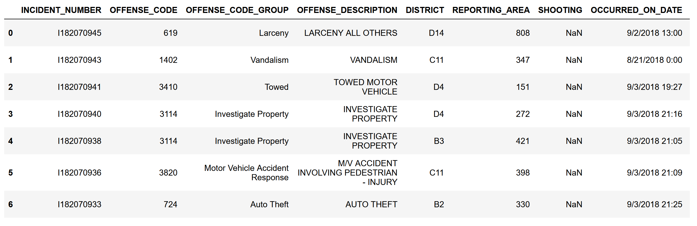
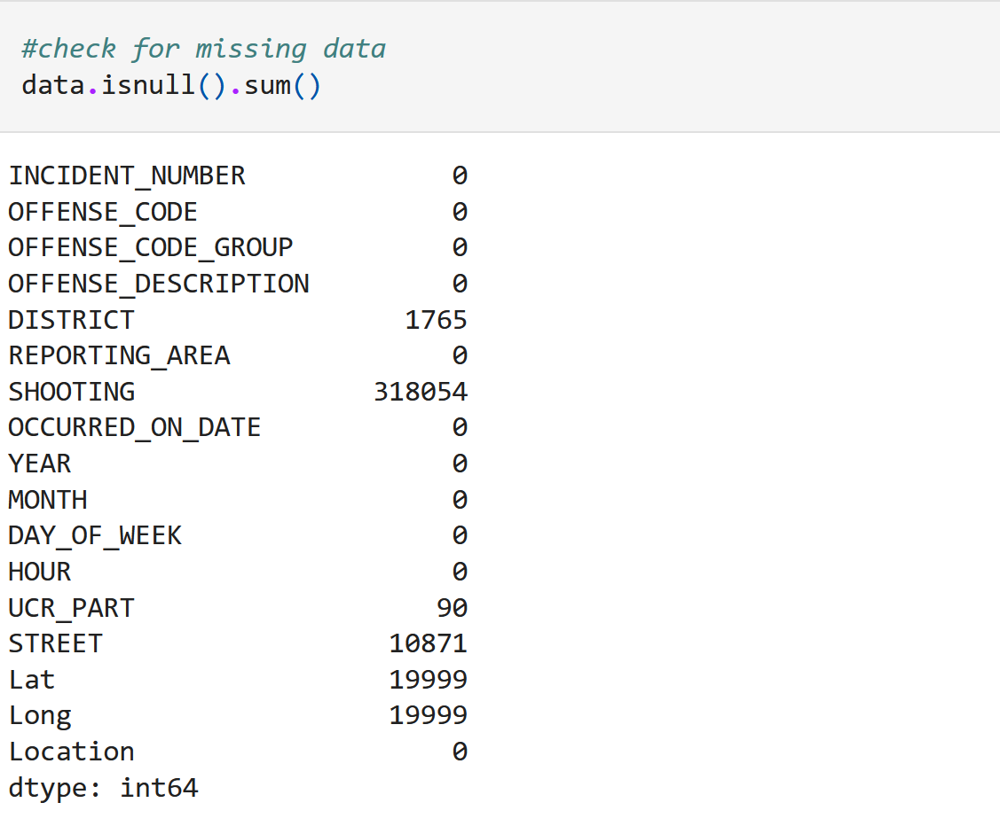
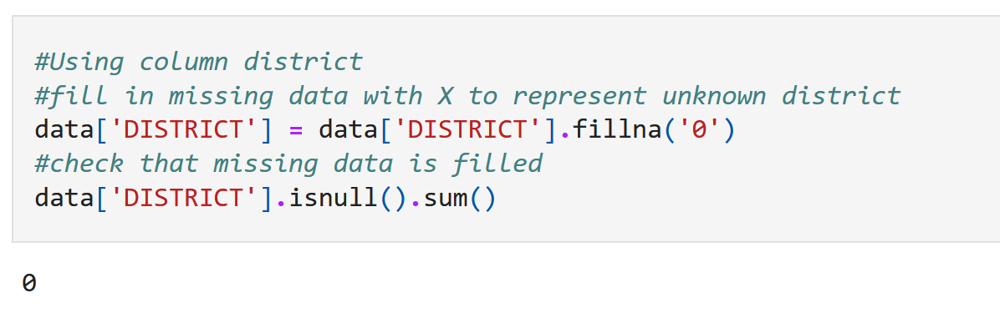
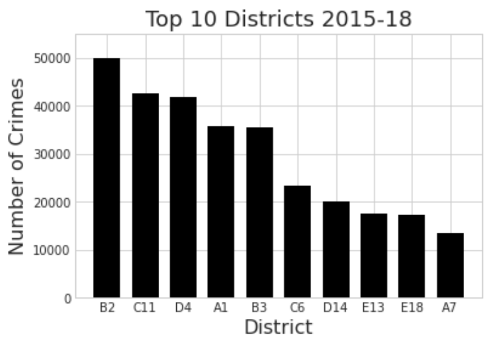
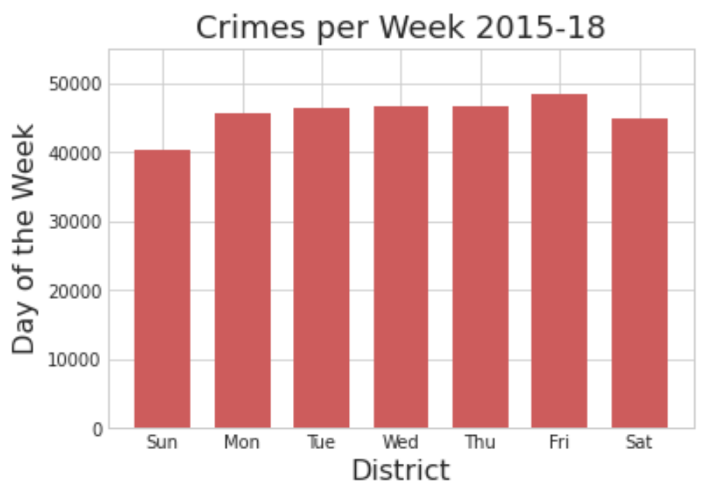
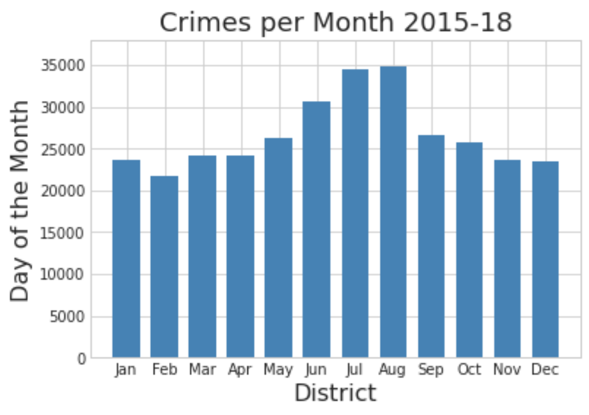
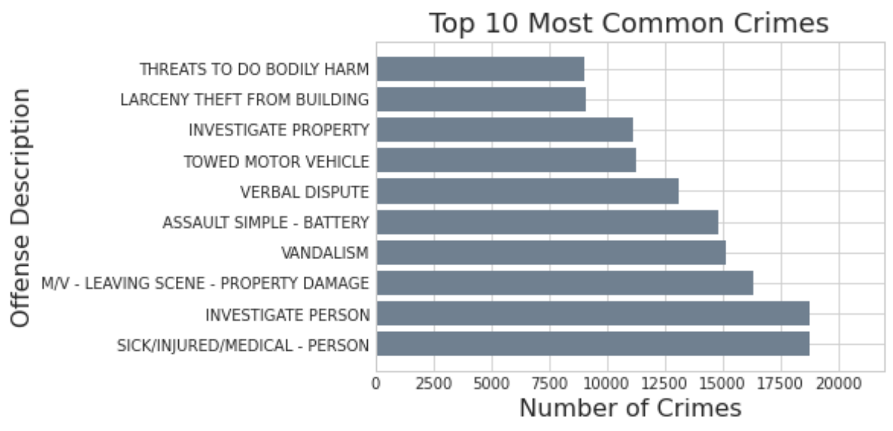

# Boston Crime Data Analysis

## Introduction
Criminal activity can happen anywhere and anytime. It is not only important for residents to know to avoid areas where criminal activity is high, but also for people planning to move to a different district to understand the possibility of crimes in that area. Police can also use this information to prevent criminal activity. In this project, I will be analyizing trends and determining areas at a higher risk of criminal activity.
  1. Which (top 10) districts are crimes most likely to occur?
  2. Does the number of crimes decrease or increase depending on the month? Day of the week?
  3. What are the top 10 most common crimes?

## Data Selection
The dataset is from Kaggle [1] and has records of crimes in Boston June 14, 2015 and continue to September 3, 2018. The source of these records were obtained from Analyze Boston which is run by the organization, Boston Police Department.
The other has over 300,000 rows of crimes in Boston with 17 columns:
- Incident Number
- Offense Code
- Offense Code Group
- Offense Description
- District
- Reporting Area
- Shooting
- Occured On Date
- Year
- Month
- Day Of The Week
- Hour (0 to 23)
- UCR Part
- Street
- Latitude
- Longitude
- Location

Data Preview:

In the column for districts 1,765 rows are missing data.
Code to show missing data:

Since one of the used data has some missing data, only the district column needs to be modified.
Instead of dropping this data, it will be filled with 0 to represent an unknown district to account for any data loss in analyzing the data.
Code to fill missing data:

## Methods
Tools: 
- Numpy and Pandas for data analysis
- Matplotlib for data visualization

Methods used with Numpy
- Functions for analyzing include: array(), arange(), etc.
- Numpy has many useful tools for handling data such as it's arrays and scientific functions that work with arrays.  

Methods used with Pandas
- Functions include: DataFrame(), read_csv(), etc.
- Pandas has many functions for reading, analyzing, cleaning, and manipulating data and is often used for data analysis.
- One of the most used functions in this project is Dataframes:
  - Dataframes allow for easy storage, analysis, and manipulation of data
  - Has functions to sort the data by column, count the number of specific rows and other useful tools
  - Was used to clean the data, and prepare the data for visualiztion
 
Methods used with Matplotlib:
- Functions include: pyplot, pyplot.subplots(), bar(), barh(), etc.
- Matplotlib allows creation of multiple types of plots for data visualiztion
  - Has useful tools to label, format, and resize the plots
- Bar graphs are useful for comparing different groups or to determine changes over time. Typically one axis show the groups and another shows the numeric value.

## Results 
1. Which (top 10) districts are crimes most likely to occur?  
The data had 12 districts including the unknown district which was labeled 0.  
Only the top 10 were used in the bar graph:

District B2 had the most crimes occurring in the span of 3 years with almost 50,000 crimes. The top 3 districts ranged between 50,000 and 40,000 while lowest in the graph ranged between 10,000 to 20,000. The two districts (A15, 0) not on the graph had lower than 10,000 crimes recorded.

2. Does the number of crimes decrease or increase depending on the month? Day of the week?  
Because the data stops on September 3, 2018, the data in these bar graphs is missing half of the data from the year 2018 and may be skewed.  
Crimes per week:

Interestingly, they all ranged in the 40,0000 to 50,000 number of incidents with Sunday having the lowest number.   
Crimes per month:

There is a noticeable gap between the first few months of the year and June to August. Since only the months after August are affected by the incomplete dataset, the months before it are not affected and is not skewed. 

3. What are the top 10 most common crimes?  
There were 222 different types of offense codes in the dataset and the top 10 common crimes are shown:

In the 3 years, there were more crimes relating to a sick/injured person and investigating a person. The top 7 crimes ranged from 20,000 to 11,000 incidents and the lowest number of incidents was about 9,000. 

## Discussion
The top 10 most districts had about 132,000 crimes in 3 districts. This implies that about one third of the crimes occur within the districts: B3, C11, and D4. People should try to avoid these districts and those who need to go there should be aware that there are frequent crimes in the area. The number of incidents per day of the week seems to show slight decreases for Sunday but could be more accurate if the dataset had all the records for the last year. The number of incidents per month seems to peek in July and August, and the top 10 most common crimes shows some of the most common crimes happening within Boston which people should watch out for. These trends could be important for people to plan their outings and be aware of criminal activity. 

For future analysis, furthur caterigorization of the data could be useful in determining which types of incidents occur the most depending on the district so that people in those areas know the specific crimes happening there. This could be done for each question to get a better understanding of criminal activity and the severity of the crimes in these districts. While there may be more crimes in certain districts, not all of them are felonies and many could be a misdemeanor. A yearly catergory could also be added to sort the data and determine changes over the years. As 3 years may not show a significant change, updating the dataset to include recent years could help in finding a pattern.

## References
[1] [Boston, Analyze. “Crimes in Boston.” Kaggle, 4 Sept. 2018, www.kaggle.com/datasets/AnalyzeBoston/crimes-in-boston.] 
