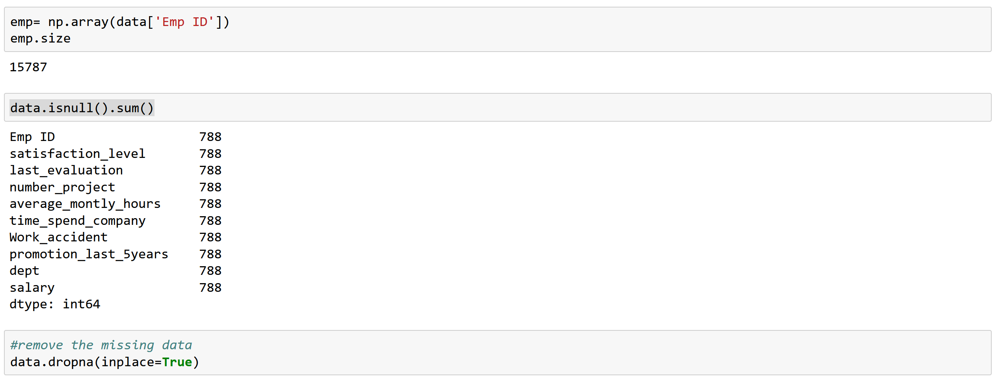

# Employee Satisfaction Data Analysis

## Introduction
Employee satifaction involves the content an employee feels in their work and is important for organizations and employers. It is difficult to maintain employee retention as employees are less likely to stay in a company if they aren't satisfied with their work. The objective of this project is to determine what factors can influence employee satisfaction. This information can be used to improve the work environment, leading to better performance, retention, and productivity from employees. In this project, these factors will be analyized to determine if there is a correlation between these and employee satisfaction.
  - Number of hours worked per month
  - Salary level
  - Promotion and work accidents

## Data Selection
The dataset is from Kaggle [1] and has over 15,000 samples of employee data with 9 columns: 
- Employee ID
- Self-reported satisfaction levels between 0 and 1
- Recent performance evaluation between 0 and 1
- Number of projects an employee is currently working on
- Average number hours worked per month
- Number of years spent in the company
- Work accidents
- Promotions within the last 5 years
- Affiliated department
- Salary levels (low, medium, high)

Dataset Preview:

Out of 15787 samples, 788 samples in all 9 columns were missing data:

Thus, there were remove because this section contained no data and would not alter the results.

## Methods
Tools: 
- Numpy and Pandas for data analysis
- Matplotlib for data visualization

Methods used with Matplotlib:
Scatterplots are frequently used to show a correlation between two variables where each individual data is ploted on the graph. Both variables are assumed to be numeric to be able to plot it on the graph. 

In cases where one variable is not a numeric value and another variable is a numeric value, a box plot will be used to compare the values within the data. A box plot can show the distribution within a category and allow for comparisons between each category. 

## References
[1] [Zakari. “Employee Satisfaction Survey Data.” Kaggle, 3 Nov. 2023, www.kaggle.com/datasets/redpen12/employees-satisfaction-analysis?select=Employee%2BAttrition.csv.]
